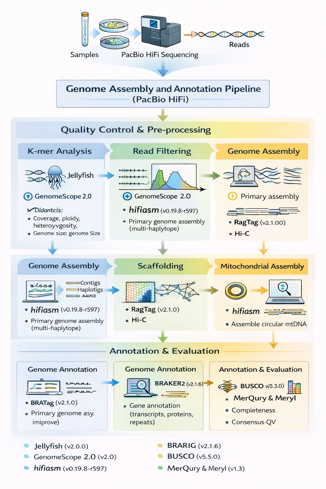

# 🧬 PacBio HiFi Genome Assembly & Annotation Pipeline

This repository provides a **complete, modular workflow** for **de novo genome assembly and annotation** using **PacBio HiFi sequencing data**.  
It covers the full process from **raw-read quality control** to **chromosome-scale scaffolding** and **annotation evaluation**, following current best practices for long-read assemblies.

The pipeline is designed to be:
- **reference-free** where possible,
- **diagnostic-first** (QC before assembly),
- **HiFi-optimized**, and
- **reproducible on HPC systems**.

---

## Workflow overview

This figure summarizes the complete workflow implemented in this repository, from raw PacBio HiFi reads to a scaffolded, annotated genome with multiple layers of quality assessment.

---

## Pipeline structure and rationale

### 1. Read-level quality control and genome characterization

Before assembly, we characterize the genome directly from sequencing reads.

**Tools**
- Jellyfish
- GenomeScope 2.0

**Purpose**
- Estimate haploid genome size
- Quantify heterozygosity
- Assess repeat content
- Measure sequencing error rate
- Validate ploidy assumptions

**Why this matters**
These metrics determine:
- expected assembly size,
- graph complexity,
- haplotig burden,
- memory requirements,
- and feasibility of downstream assembly strategies.

This step is entirely reference-free.

---

### 2. Genome assembly (nuclear genome)

**Tool**
- hifiasm

**Approach**
- HiFi-only de novo assembly
- Generation of primary contigs and alternate haplotypes (haplotigs)

**Key features**
- Phasing-aware assembly graph
- Robust performance at moderate coverage
- Well suited for diploid and moderately heterozygous genomes

The output of this step forms the basis for all downstream analyses.

---

### 3. Post-assembly quality evaluation

**Tools**
- Merqury
- Meryl

**Metrics**
- Consensus quality value (QV)
- k-mer completeness
- Assembly correctness independent of a reference

**Why this matters**
Merqury evaluates the assembly using the same k-mer logic as the initial QC step, providing a consistent, reference-free measure of assembly accuracy and completeness.

---

### 4. Assembly completeness assessment

**Tool**
- BUSCO

**Purpose**
- Evaluate gene-space completeness using lineage-specific orthologs
- Compare alternative assemblies or polishing strategies

BUSCO complements k-mer–based metrics by focusing on biologically conserved genes.

---

### 5. Chromosome-scale scaffolding

**Tools**
- RagTag
- Hi-C data (optional but recommended)

**Purpose**
- Order and orient contigs
- Resolve misassemblies
- Generate chromosome-scale scaffolds

This step integrates long-range information while preserving the high base accuracy of HiFi assemblies.

---

### 6. Mitochondrial genome assembly

**Tool**
- hifiasm (mitochondrial mode)

**Purpose**
- Assemble circular mitochondrial genome directly from HiFi reads
- Independent of nuclear assembly

This provides a high-quality mitochondrial genome suitable for phylogenetics and barcoding.

---

### 7. Genome annotation

**Tool**
- BRAKER

**Inputs**
- Assembled genome
- Protein and/or RNA-seq evidence (optional but recommended)

**Output**
- Gene models
- Transcript structures
- Functional annotation-ready files

BRAKER enables automated, evidence-driven annotation suitable for non-model organisms.

---

### 8. Annotation evaluation

**Tools**
- BUSCO
- OMArk

**Purpose**
- Assess completeness of annotated gene sets
- Evaluate annotation quality beyond raw assembly metrics

This ensures that both the **genome sequence** and the **biological interpretation** are robust.

---

## Design principles

This repository follows several guiding principles:

- **QC-first**: diagnose the genome before assembling it  
- **Reference-free metrics** whenever possible  
- **HiFi-native tools**, avoiding Illumina-centric assumptions  
- **Clear separation of steps**, enabling modular reuse  
- **HPC-ready**, with scalable scripts and reproducible outputs  

---

## Typical use cases

- De novo assembly of diploid eukaryotic genomes
- HiFi-only assembly pipelines
- Genome projects requiring reference-free validation
- Comparative genomics and annotation-ready assemblies

---

## Repository organization (high level)

